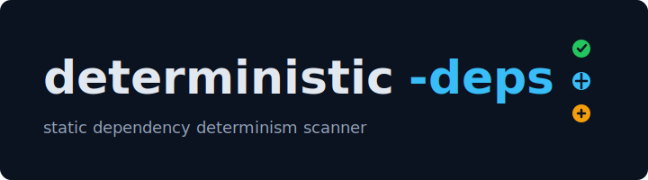

<p align="center">
  
</p>

<p align="center"><strong>Static dependency determinism scanning for GitHub Actions, containers, IaC, and package manifests.</strong></p>

<p align="center">
  <a href="https://github.com/Ozark-Security-Labs/deterministic-deps/actions/workflows/ci.yml"></a>
  <a href="https://github.com/Ozark-Security-Labs/deterministic-deps/actions/workflows/security-hygiene.yml"></a>
  <a href="https://github.com/Ozark-Security-Labs/deterministic-deps/actions/workflows/codeql.yml"></a>
  <a href="LICENSE"></a>
  
  <a href="https://github.com/Ozark-Security-Labs/deterministic-deps/releases"></a>
</p>

---

`deterministic-deps` is a GitHub Action that reports dependency declarations that can drift over time. It is language-agnostic, works by static analysis only, and favors SHA, digest, hash, exact-version, and lockfile based determinism.

The default mode is advisory: the action emits annotations, writes a Markdown report, and produces SARIF without failing CI. Switch to enforce mode when your project is ready to block non-deterministic declarations.

## Quick Start

```yaml
name: dependency determinism

on:
  pull_request:
  push:
    branches: [main]

jobs:
  deterministic-deps:
    runs-on: ubuntu-24.04
    permissions:
      contents: read
      security-events: write
    steps:
      - uses: actions/checkout@<full-commit-sha>
      - uses: Ozark-Security-Labs/deterministic-deps@v1
        with:
          mode: advisory
```

Install from the
[GitHub Marketplace listing](https://github.com/marketplace/actions/deterministic-deps), or review
the [latest release](https://github.com/Ozark-Security-Labs/deterministic-deps/releases/latest)
before pinning a validated version.

To fail builds once findings are actionable:

```yaml
- uses: Ozark-Security-Labs/deterministic-deps@<full-length-commit-sha>
  with:
    mode: enforce
    severity-threshold: medium
```

## Code Scanning SARIF Upload

The action writes SARIF by default and exposes the generated path as `sarif-path`. Upload it with GitHub code scanning in advisory mode:

```yaml
name: dependency determinism

on:
  pull_request:
  push:
    branches: [main]

jobs:
  deterministic-deps:
    runs-on: ubuntu-24.04
    permissions:
      contents: read
      security-events: write
    steps:
      - uses: actions/checkout@de0fac2e4500dabe0009e67214ff5f5447ce83dd
      - id: deterministic-deps
        uses: Ozark-Security-Labs/deterministic-deps@v1
        with:
          mode: advisory
          sarif: true
      - uses: github/codeql-action/upload-sarif@e46ed2cbd01164d986452f91f178727624ae40d7
        if: always() && steps.deterministic-deps.outputs.sarif-path != ''
        with:
          sarif_file: ${{ steps.deterministic-deps.outputs.sarif-path }}
          category: deterministic-deps
```

In enforce mode, keep the scan step non-blocking long enough to upload the SARIF, then fail the job afterward if the action found threshold-matching findings:

```yaml
name: dependency determinism

on:
  pull_request:
  push:
    branches: [main]

jobs:
  deterministic-deps:
    runs-on: ubuntu-24.04
    permissions:
      contents: read
      security-events: write
    steps:
      - uses: actions/checkout@de0fac2e4500dabe0009e67214ff5f5447ce83dd
      - id: deterministic-deps
        uses: Ozark-Security-Labs/deterministic-deps@<full-length-commit-sha>
        continue-on-error: true
        with:
          mode: enforce
          severity-threshold: medium
          sarif: true
      - uses: github/codeql-action/upload-sarif@e46ed2cbd01164d986452f91f178727624ae40d7
        if: always() && steps.deterministic-deps.outputs.sarif-path != ''
        with:
          sarif_file: ${{ steps.deterministic-deps.outputs.sarif-path }}
          category: deterministic-deps
      - name: Fail when deterministic-deps failed
        if: steps.deterministic-deps.outcome == 'failure'
        run: exit 1
```

The Marketplace entrypoint is `Ozark-Security-Labs/deterministic-deps@v1`. For workflows that
enforce policy, pin to a full commit SHA for the validated release. See
[docs/sarif.md](docs/sarif.md) for permissions, private repository notes, SARIF upload, and report
path details.

## Inputs

| Input                 | Default                    | Description                                                                     |
| --------------------- | -------------------------- | ------------------------------------------------------------------------------- |
| `mode`                | `advisory`                 | Use `advisory` to report only or `enforce` to fail at the configured threshold. |
| `path`                | `.`                        | Repository path to scan.                                                        |
| `config`              | `.deterministic-deps.yml`  | Optional YAML config path, relative to `path`.                                  |
| `include`             | supported dependency files | Newline or comma-separated glob patterns.                                       |
| `exclude`             | common vendor/build dirs   | Newline or comma-separated glob patterns.                                       |
| `severity-threshold`  | `low`                      | Minimum severity that fails the action in enforce mode.                         |
| `sarif`               | `true`                     | Write a SARIF report for code scanning upload.                                  |
| `patch`               | `false`                    | Write a unified diff with safe remediation suggestions.                         |
| `remote-validation`   | `false`                    | Opt in to remote validation of immutable GitHub commit references.              |
| `remote-token-policy` | `auto`                     | Controls whether `GITHUB_TOKEN` may be sent during remote validation.           |
| `remote-timeout-ms`   | `5000`                     | Per-request timeout for remote validation.                                      |
| `remote-retries`      | `1`                        | Retry count for transient remote validation failures.                           |

Invalid direct inputs emit GitHub Actions warnings and fall back deterministically to the matching
config value when one exists, or to the default above. Accepted values are `advisory` or `enforce`
for `mode`; `low`, `medium`, or `high` for `severity-threshold`; `auto` or `never` for
`remote-token-policy`; `true` or `false` for boolean inputs; and non-negative integers for remote
timeout and retry inputs.

## Outputs

| Output          | Description                     |
| --------------- | ------------------------------- |
| `finding-count` | Total findings.                 |
| `high-count`    | High severity findings.         |
| `medium-count`  | Medium severity findings.       |
| `low-count`     | Low severity findings.          |
| `report-path`   | Markdown report path.           |
| `sarif-path`    | SARIF report path when enabled. |
| `patch-path`    | Patch report path when enabled. |

## Supported Ecosystems

| Ecosystem              | V1 coverage                                                                                                      |
| ---------------------- | ---------------------------------------------------------------------------------------------------------------- |
| GitHub Actions         | Workflow and action `uses:` refs, reusable workflows, `runs-on` labels, and `docker://` action image references. |
| Containers             | Dockerfiles, Docker Compose files, and devcontainer image references.                                            |
| Terraform and OpenTofu | Git module refs, provider constraints, and `.terraform.lock.hcl` coverage.                                       |
| Node.js                | npm, Yarn, and pnpm manifests and lockfiles.                                                                     |
| Python                 | `requirements*.txt`, `pyproject.toml`, Pipfile, Poetry, uv, and Pipenv lockfile coverage.                        |
| Go                     | `go.mod`, `go.sum`, and git-like replacement refs.                                                               |
| Rust                   | `Cargo.toml`, `Cargo.lock`, git dependency revisions, and Rust toolchain files.                                  |
| JVM                    | Maven `pom.xml`, Gradle Groovy/Kotlin builds, and Gradle lock or verification metadata.                          |
| Ruby                   | Gemfile dependency refs and `Gemfile.lock` coverage.                                                             |

See [docs/ecosystems.md](docs/ecosystems.md) and [docs/rules.md](docs/rules.md) for the full rule catalog.

## Remote Validation

By default, the action is fully offline and only checks whether immutable refs are syntactically pinned. Set `remote-validation: true` to make GitHub API requests that confirm pinned GitHub Action SHAs and GitHub-hosted git dependency SHAs exist.

Remote validation uses `GITHUB_API_URL` and `GITHUB_SERVER_URL` when present, so it supports
GitHub.com and GitHub Enterprise Server from GitHub Actions runners. Outside GitHub Actions it
defaults to `https://api.github.com` and `https://github.com`.

Remote validation may reveal repository names and commit SHAs to the configured GitHub server, can
be affected by API rate limits, and may be slower than static analysis. Public refs can be validated
without credentials. When `GITHUB_TOKEN` is present, the default `remote-token-policy: auto` sends it
only to trusted HTTPS GitHub API hosts: `https://api.github.com` for GitHub.com, or a host matching
`GITHUB_SERVER_URL` for GitHub Enterprise Server. Mismatched, arbitrary, or non-HTTPS API URLs omit
the token and emit a warning. Use `remote-token-policy: never` to omit the token for every remote
validation request.

## Remediation Suggestions

Findings may include structured suggestions when the scanner can point to a precise replacement. Markdown reports show these suggestions, SARIF includes `fixes` for safe exact-line replacements, and `patch: true` writes a unified diff to `deterministic-deps-report/suggestions.patch` without modifying source files.

Suggestions are intentionally conservative. The action does not resolve latest SHAs, tags, versions, or digests automatically, so most findings remain guidance-only until a deterministic replacement is already present in the source.
Credential-bearing dependency strings are redacted in findings and reports. Patch and SARIF fix output skips credential-bearing replacements because those formats preserve source lines.

## Configuration

```yaml
mode: advisory
severity-threshold: low

exclude:
  - fixtures/**

rules:
  containers/image-digest: true
  node/non-deterministic-spec: true

severity:
  python/hash-pinned-requirement: low

allowlist:
  - file: legacy/Dockerfile
    ruleId: containers/image-digest
```

For large repositories, keep the scan root as narrow as practical and use `include` to target the
dependency ecosystems you care about. Default excludes already prune common generated and vendor
directories such as `.git`, `node_modules`, `dist`, `build`, `target`, `.terraform`, virtualenvs,
and `__pycache__`; add repository-specific generated paths to `exclude` when monorepo tooling writes
dependencies under other directories.

See [docs/configuration.md](docs/configuration.md) for the full schema.

## V1 Known Limits

- Static analysis is the default. The action does not resolve package registries, clone dependency
  sources, or inspect dependency graph APIs.
- Remote validation is explicit opt-in and limited to immutable GitHub.com or GitHub Enterprise
  Server commit refs.
- Container image digest syntax is checked locally, but registry digest existence is not validated.
- Remediation suggestions are conservative and only produce patches when the deterministic
  replacement is already present in the scanned source.
- Parser coverage is intentionally focused on common dependency declarations; use `allowlist`,
  `rules`, and `ecosystems` configuration for repository-specific policy exceptions.

## Feedback

Please open a
[bug report](https://github.com/Ozark-Security-Labs/deterministic-deps/issues/new?template=bug_report.yml)
for false positives, false negatives, confusing remediation, setup friction, or action failures.
Include the relevant dependency snippet, rule id or ecosystem when known, action inputs or
`.deterministic-deps.yml`, and the report or log excerpt so the case can be reproduced.

## Local Development

```bash
npm ci
npm run all
```

The bundled `dist/index.js` is committed so the action can run directly from repository refs. Run `npm run bundle` after source changes and commit the updated `dist/` output.

## Security

This action performs static analysis by default. It does not fetch package registries, clone dependency sources, or rewrite dependency declarations. Remote validation is explicit opt-in and limited to checking immutable GitHub commit refs. Please report vulnerabilities according to [SECURITY.md](SECURITY.md).

## License

deterministic-deps is licensed under the GNU Affero General Public License v3.0 only.
Commercial licenses are available for proprietary embedding; contact Ozark Security Labs.
